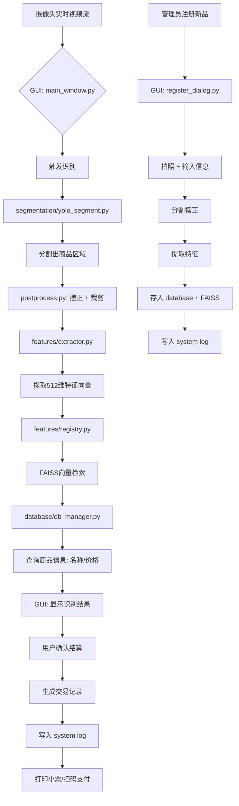

##### 智能商品结算系统

需求是高精度，动态类别，实现结算商品系统，

我目前是的思路是将商品分为一个大类，如果瓶装，盒装，袋装，罐装，这种大类，每个大类有不同的小类，如训练时瓶装用农夫山泉，怡宝，测试时候就是哇哈哈，整个项目首先是用`yolov8`分割模型并提取到该类别，然后通过特征提取模型的输出与特征注册库进行匹配，使用余弦距离进行计算，需要解决的是类别不固定问题，比如后期进货新品难道还要训练模型嘛？所以需要解决模型频繁更新问题，特征提取模型要能够识别出同一类别下不同对象的差异性，比如人脸，中国人，日本人，美国人，在这个项目中，应该具有识别同一类水，不同的对象，可口可乐，百事可乐，对模型的特征提取能力要求较高，我认为可以是采用`ArcLoss`，当进货的商品是新对象，那么可以通过注册到特征库中，通过不同的角度进行注册就可就行，这样大大的减少了模型频繁更新的问题，类别的固定我认为是输出层导致的，与主干网络无关，主干网络只是特征的提取，把主干和输出分开做，限制类别固定的是`one-hot`直接使用`label`就行，还有就是如何设计一个好的图像特征提取模型？足够深得网络和`ArcLoss`，以及大量得数据集，特征注册部分，可以采用数据库，或者txt？这个地方也需要好好考虑设计，因为这里和金钱挂钩，还有就是特征向量和注册库得特征向量得匹配置信度，需要达到0.9及以上，同时需要多帧连续检测，统计频率最高得，送入特征提取模型得数据集也是非常重要得，只有分割才能去噪到最好，需要抠图，同时需要将抠图得商品进行摆正，通过计算`opencv`最小外接矩形，并知道得角度，通过角度实现统一，还有就是统一缩放为正方形，可以考虑采用`yolo`官方的算子借鉴实现，卷积对中心橡素的特征提取能力强，对边缘特征提取能力弱，需要想办法解决这个问题，让去缩放在中心位置，或则可以考虑先摆正后再通过最大的外接矩形剪切到一个黑色蒙版上贴图上去？

一个好的特征提取网络，需要足够深，如resnet50以上，特征向量维度不能低于512，甚至更高，训练特征提取模型可以使用`NLLLoss+ArcLoss`，前端交互界面使用`python Qt`

```python
[摄像头输入]
     ↓
[YOLOv8-Segmentation 模型] → 提取商品Mask并抠图
     ↓
[图像预处理模块] → 摆正 + 裁剪 + 归一化
     ↓
[主干特征提取模型] → ResNet50 / ConvNeXt / ViT + ArcFace Head
     ↓
[特征向量] → (512~1024维)
     ↓
[特征匹配引擎] ←→ [特征注册数据库]
     ↓
[决策引擎：多帧投票 + 置信度阈值]
     ↓
[Qt 前端界面显示结果 + 计价]
     ↓
[结算完成 / 异常提示]
```

### 多帧融合决策机制（防抖动、提准确率）

单帧容易误判，采用 **时间窗口投票机制**

#### 策略：

- 连续采集 3~5 帧
- 每帧输出一个预测结果（含置信度）
- 统计最高频次且平均置信度 > 0.9 的结果
- 若不一致 → 提示“请重新放置商品”

### 前端交互设计（PyQt5/6）

#### 主要功能：

- 实时视频流显示
- 商品识别结果浮动框
- 计价面板（总价、清单）
- 注册新商品按钮（管理员权限）
- 日志记录（交易流水）

#### 数据库

**SQLite + FAISS（独立索引）**

##### 商品主表

```sql
CREATE TABLE products (
    id TEXT PRIMARY KEY,           -- 商品唯一ID，如 B001, C002
    name TEXT NOT NULL,            -- 名称：农夫山泉 550ml
    price REAL NOT NULL,           -- 价格（单位：元）
    category TEXT NOT NULL,        -- 大类：bottle, box, bag, can
    image_count INTEGER DEFAULT 1, -- 注册时使用的图像数量
    created_time DATETIME DEFAULT CURRENT_TIMESTAMP,
    updated_time DATETIME DEFAULT CURRENT_TIMESTAMP
);
```

##### 特征模板表

```sql
CREATE TABLE feature_templates (
    id INTEGER PRIMARY KEY AUTOINCREMENT,
    product_id TEXT NOT NULL,
    angle INTEGER DEFAULT 0,       -- 拍摄角度（可选）
    feature_data BLOB NOT NULL,    -- 存储 numpy array (pickle.dumps)
    FOREIGN KEY (product_id) REFERENCES products(id)
);
```

可以为每个商品注册多个角度的特征，识别时取平均或最大相似度。

建表命令

```sql
-- 设置客户端字符集
SET NAMES utf8mb4;

-- 切换到名为 feature_database 的数据库
USE feature_database;

-- ------------------------------
-- 1. 创建主表：products（商品信息）
-- ------------------------------
CREATE TABLE products (
    id VARCHAR(32) PRIMARY KEY,                    -- 商品唯一ID，如 B001, C002
    name VARCHAR(128) NOT NULL,                   -- 商品名称：农夫山泉 550ml
    price DECIMAL(10,2) NOT NULL,                 -- 精确价格（单位：元）
    category VARCHAR(32) NOT NULL,                -- 大类：bottle, box, bag, can
    created_time DATETIME DEFAULT CURRENT_TIMESTAMP, -- 创建时间
    updated_time DATETIME DEFAULT CURRENT_TIMESTAMP ON UPDATE CURRENT_TIMESTAMP -- 修改时间
) ENGINE=InnoDB 
  DEFAULT CHARSET=utf8mb4 
  COLLATE=utf8mb4_general_ci;

-- 为 category 字段添加索引（加快按类别查询）
CREATE INDEX idx_category ON products(category);

-- ------------------------------
-- 2. 创建副表：feature_templates（特征模板）
-- ------------------------------
CREATE TABLE feature_templates (
    id BIGINT AUTO_INCREMENT PRIMARY KEY,         -- 特征唯一ID（自增）
    product_id VARCHAR(32) NOT NULL,              -- 关联主表商品ID
    category VARCHAR(32) NOT NULL,                -- 大类（用于快速过滤，避免JOIN）
    feature_data MEDIUMBLOB NOT NULL,             -- 存储特征向量（如512维float32）
    created_time DATETIME DEFAULT CURRENT_TIMESTAMP, -- 创建时间

    -- 外键约束：确保特征必须对应一个存在的商品
    CONSTRAINT fk_product_id 
        FOREIGN KEY (product_id) 
        REFERENCES products(id) 
        ON DELETE CASCADE, -- 删除商品时，自动删除其所有特征

    -- 索引：加快按商品ID和类别查询
    INDEX idx_product_id (product_id),
    INDEX idx_ft_category (category)
) ENGINE=InnoDB 
  DEFAULT CHARSET=utf8mb4 
  COLLATE=utf8mb4_general_ci;
```

表

```sql
-- 1. 清空表并重置自增ID
TRUNCATE TABLE feature_templates;

-- 1. 删除所有数据
DELETE FROM feature_templates;

-- 2. 重置自增计数器
ALTER TABLE feature_templates AUTO_INCREMENT = 1;
```


主表ID通过设计自增表实现

| 中文 | 英文类别  | 建议 ID 前缀 |
| ---- | --------- | ------------ |
| 瓶装 | bottle    | B            |
| 盒装 | box       | X            |
| 罐装 | can       | C            |
| 袋装 | soft_pack | S            |

设计计算表

```sql
-- ------------------------------
-- 3. 创建计数器表：id_counter（用于生成带前缀的自增ID）
-- ------------------------------
CREATE TABLE id_counter (
    category_prefix CHAR(1) PRIMARY KEY,        -- 前缀字符：B, X, C, S
    category_name   VARCHAR(32) NOT NULL,       -- 对应的类别名：bottle, box, can, soft_pack
    next_id         INT NOT NULL DEFAULT 1,     -- 下一个编号（从1开始）
    created_time    DATETIME DEFAULT CURRENT_TIMESTAMP,
    updated_time    DATETIME DEFAULT CURRENT_TIMESTAMP ON UPDATE CURRENT_TIMESTAMP,

    -- 确保 category_name 唯一
    UNIQUE KEY uk_category_name (category_name)
) ENGINE=InnoDB 
  DEFAULT CHARSET=utf8mb4 
  COLLATE=utf8mb4_general_ci;

-- ------------------------------
-- 4. 初始化计数器数据
-- ------------------------------
INSERT INTO id_counter (category_prefix, category_name, next_id) VALUES
('B', 'bottle',     1),
('X', 'box',        1),
('C', 'can',        1),
('S', 'soft_pack',  1);
```

设计向量自增表

```python
CREATE TABLE feature_mappings (
    feature_id INT AUTO_INCREMENT PRIMARY KEY,
    product_id VARCHAR(50) NOT NULL,
     created_time    DATETIME DEFAULT CURRENT_TIMESTAMP,
    updated_time    DATETIME DEFAULT CURRENT_TIMESTAMP ON UPDATE CURRENT_TIMESTAMP,
    INDEX idx_product_id (product_id)
);
```


##### 项目架构

```python
fruit_classifier/
│
├── config/                       # 📄 配置文件（YAML格式）
│   ├── train.yaml                # 训练配置（模型、数据、超参）
│   ├── infer.yaml                # 推理配置（摄像头、阈值、路径）
│   └── database.yaml             # 数据库与存储路径
│
├── data/                         # 📁 数据处理模块
│   ├── dataset.py                # 自定义Dataset（用于训练）
│   ├── dataloader.py             # DataLoader构建
│   ├── split_dataset.py          # 划分train/val/test
│   └── enhance/                  # 数据增强
│       ├── geometric.py          # 旋转、翻转
│       ├── color.py              # 亮度、对比度
│       └── __init__.py
│
├── models/                       # 🧠 模型定义与构建
│   ├── backbone/                 # 主干网络（ResNet, ConvNeXt等）
│   │   ├── resnet.py
│   │   ├── convnext.py
│   │   └── __init__.py
│   ├── heads/                    # 分类头（ArcFace等）
│   │   ├── arcface.py
│   │   └── __init__.py
│   ├── build_model.py            # 构建完整模型
│   └── zoo/                      # 预训练权重缓存
│       └── convnext_tiny.pth
│
├── features/                     # 🔍 特征提取与匹配
│   ├── extractor.py              # 特征提取器（推理用）
│   ├── registry.py               # 特征注册与相似性搜索
│   └── storage/                  # 特征存储
│       └── index.faiss           # FAISS向量索引文件
│
├── database/                     # 💾 数据库模块（SQLite + CRUD）
│   ├── schema.sql                # 表结构SQL
│   ├── db_manager.py             # 数据库操作封装
│   └── goods.db                  # 商品数据库（自动创建，.gitignore）
│
├── engine/                       # ⚙️ 核心引擎
│   ├── trainer.py                # 训练流程控制
│   ├── validator.py              # 验证与评估
│   └── inference.py              # 实时推理引擎
│
├── segmentation/                 # ✂️ YOLO实例分割
│   ├── yolo_segment.py           # YOLOv8分割接口
│   └── postprocess.py            # 掩码处理、摆正、裁剪
│
├── gui/                          # 🖥️ 图形用户界面（PyQt5/6）
│   ├── main_window.py            # 主窗口
│   ├── widgets/                  # 自定义控件
│   │   ├── video_widget.py       # 视频流显示
│   │   ├── product_list.py       # 结算清单
│   │   ├── status_bar.py         # 状态栏（FPS、设备）
│   │   └── control_panel.py      # 控制按钮
│   ├── dialogs/                  # 弹窗
│   │   ├── register_dialog.py    # 新品注册
│   │   ├── payment_dialog.py     # 支付确认
│   │   └── error_dialog.py       # 错误提示
│   ├── resources/                # 资源文件
│   │   ├── icons/                # 图标
│   │   ├── styles/               # 样式表（QSS）
│   │   │   └── dark_theme.qss
│   │   └── sounds/               # 提示音效
│   ├── themes/                   # 主题管理
│   └── utils/                    # GUI工具
│       ├── screen_capture.py     # 截图注册
│       └── qt_logger.py          # 日志显示到界面
│
├── modules/                      # 🧩 自定义网络结构
│   └── custom_net.py
│
├── utils/                        # 🛠️ 工具函数
│   ├── logger.py                 # 双日志系统（训练 + 系统）
│   ├── io.py                     # 文件读写、pickle、json
│   ├── visualization.py          # t-SNE、特征可视化
│   ├── timer.py                  # 性能测试
│   └── __init__.py
│
├── logs/                         # 📝 日志输出
│   ├── train/                    # 🔵 训练日志（TensorBoard）
│   │   └── 20250810_143045/
│   │       ├── events.out.tfevents.*
│   │       ├── metrics.txt
│   │       └── checkpoints/
│   └── system/                   # 🟢 系统运行日志（文本）
│       ├── 2025-08-10.log
│       ├── 2025-08-11.log
│       └── system.log -> latest
│
├── scripts/                      # ▶️ 用户入口脚本
│   ├── train.py                  # 启动训练
│   ├── infer.py                  # 启动GUI结算系统
│   └── register.py               # 独立注册脚本（可选）
│
├── tests/                        # ✅ 单元测试
│   ├── test_db.py
│   ├── test_feature.py
│   └── test_segmentation.py
│
├── docs/                         # 📚 文档（可选）
│   ├── API.md
│   └── USER_GUIDE.md
│
├── requirements.txt              # 依赖包
├── README.md                     # 项目说明
└── main.py                       # 主程序入口（可选，建议用scripts）
```

系统工作流程图



GUI布局设计

```
+-------------------------------------------------------------+
| 智能商品结算系统                            [最小化] [关闭] |
+----------------------------+--------------------------------+
|                            |                                |
|   📹 实时视频画面           |    🧾 结算清单                   |
|   （带识别框）              |                                 |
|                            |  • 农夫山泉 550ml  ×1  2.50元    |
|                            |  • 娃哈哈纯净水  ×1  2.00元      |
|                            |                                |
|                            |    🧮 总价：4.50元              |
|                            |                                |
+----------------------------+--------------------------------+
|  [📷 注册新品]   [✅ 结算]   [🗑️ 清空]     [⚙️ 设置]          |
+-------------------------------------------------------------+
| 状态: 正常 | FPS: 18 | 设备: Camera0 | 数据库: OK | 时间: 10:16 |
+-------------------------------------------------------------+
```

多线程有问题

```
UI线程（主线程）
   ↓
QTimer 触发 → 读帧 → 启动【后台线程推理】
   ↓
主线程继续响应点击、动画等（不卡）
   ↓
后台线程完成推理 → 发信号
   ↓
主线程接收信号 → 显示结果
```

线程架构的设计

```python
+---------------------+
|   视频源读取层        |
|   - QTimer           |
|   - 读摄像头/视频     |
|   - 提交帧给 InferenceManager |
+----------+----------+
           ↓ submit_frame()
+----------v----------+
|   推理处理层          | ← QRunnable + QThreadPool
|   InferenceManager    |
|                     |
|   - 模型流水线        |
|   - 后台线程池        |
|   - 帧队列（可选）     |
|   - 执行 Seg/Track/Cls |
+----------+----------+
           ↓ 信号 → on_result()
+----------v----------+
|   UI 显示层           |
|   - QLabel 显示结果   |
|   - 更新金额/日志     |
+---------------------+
```

架构设计

```
[主线程]                          [子线程]                     [主线程]
   ↓                                 ↓                           ↓
读取一帧 frame                  执行模型推理                   更新 UI
   ↓                                 ↓                           ↓
InferenceManager.submit_frame()   run() → Seg+Track+Cls      on_result() 显示
   ↓                                 ↓                           ↓
放入线程池队列                  处理完成后 emit 信号         接收信号，更新 label
```

将后处理推到GPU

```
pip install -i https://mirrors.aliyun.com/pypi/simple/ cupy-cuda11x --trusted-host mirrors.aliyun.com
```

```
pip install -i https://mirrors.aliyun.com/pypi/simple/ cucim --trusted-host mirrors.aliyun.com
```

```
import cupy as cp
import cucim as cc

print("CuPy version:", cp.__version__)
print("CuPy CUDA version:", cp.cuda.runtime.runtimeGetVersion())

# 创建一个简单的 GPU 数组
x = cp.array([1, 2, 3])
print("CuPy array:", x)
print("Is x on GPU?", isinstance(x, cp.ndarray))

# 测试 cucim
import numpy as np
data = np.random.rand(128, 128).astype(np.float32)
data_gpu = cp.asarray(data)
transformed = cc.skimage.transform.rotate(data_gpu, angle=45)
print("cucim rotate test passed. Output shape:", transformed.shape)
```

torch

```
pip install kornia -i https://mirrors.aliyun.com/pypi/simple/ --trusted-host mirrors.aliyun.com
```

