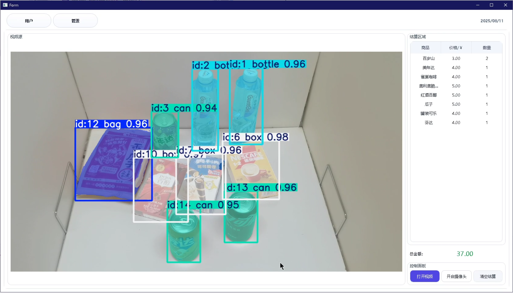
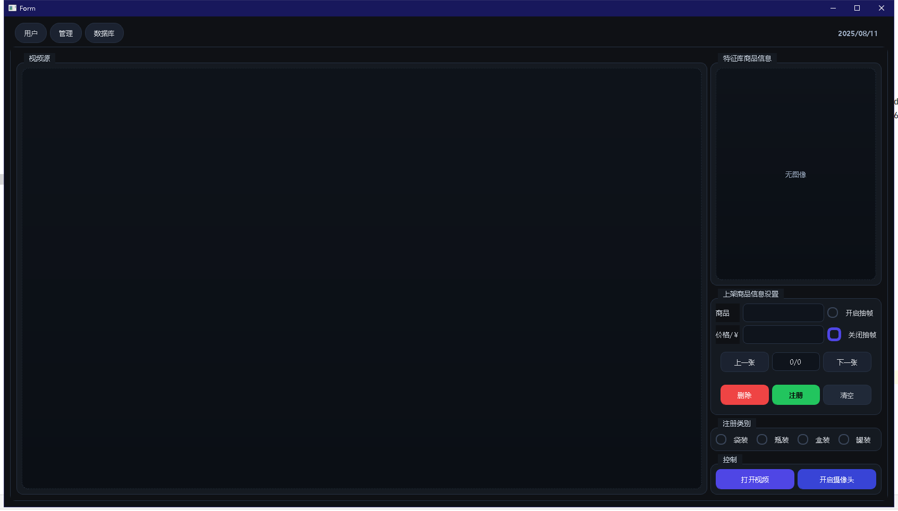
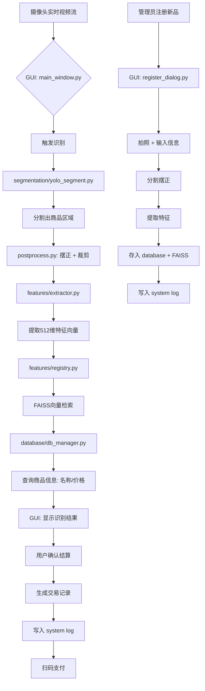

## 智能商品结算系统

##### 识别界面



##### 注册界面



基础架构

```python
[摄像头输入]
     ↓
[YOLOv8-Segmentation 模型] → 提取商品Mask并抠图
     ↓
[图像预处理模块] → 摆正 + 裁剪 + 归一化
     ↓
[主干特征提取模型] → ResNet50 / ConvNeXt / ViT + ArcFace Head
     ↓
[特征向量] → (512~1024维)
     ↓
[特征匹配引擎] ←→ [特征注册数据库]
     ↓
[决策引擎：多帧投票 + 置信度阈值]
     ↓
[Qt 前端界面显示结果 + 计价]
     ↓
[结算完成 / 异常提示]
```

### 多帧融合决策机制（防抖动、提准确率）

单帧容易误判，采用 **时间窗口投票机制**

#### 策略：

- 连续采集 30~50 帧
- 每帧输出一个预测结果（含置信度）
- 统计最高频次且平均置信度 > 0.9 的结果
- 若不一致 → 提示“请重新放置商品”

### 前端交互设计

#### 主要功能：

- 实时视频流显示
- 商品识别结果浮动框
- 计价面板（总价、清单）
- 注册新商品按钮（管理员权限）
- 日志记录（交易流水）

#### 数据库

`MySQL`

```sql
-- 设置客户端字符集
SET NAMES utf8mb4;

-- 切换到名为 feature_database 的数据库
USE feature_database;

-- ------------------------------
-- 1. 创建主表：products（商品信息）
-- ------------------------------
CREATE TABLE products (
    id VARCHAR(32) PRIMARY KEY,                    -- 商品唯一ID，如 B001, C002
    name VARCHAR(128) NOT NULL,                   -- 商品名称：农夫山泉 550ml
    price DECIMAL(10,2) NOT NULL,                 -- 精确价格（单位：元）
    category VARCHAR(32) NOT NULL,                -- 大类：bottle, box, bag, can
    created_time DATETIME DEFAULT CURRENT_TIMESTAMP, -- 创建时间
    updated_time DATETIME DEFAULT CURRENT_TIMESTAMP ON UPDATE CURRENT_TIMESTAMP -- 修改时间
) ENGINE=InnoDB 
  DEFAULT CHARSET=utf8mb4 
  COLLATE=utf8mb4_general_ci;

-- 为 category 字段添加索引（加快按类别查询）
CREATE INDEX idx_category ON products(category);

-- ------------------------------
-- 2. 创建副表：feature_templates（特征模板）
-- ------------------------------
CREATE TABLE feature_templates (
    id BIGINT AUTO_INCREMENT PRIMARY KEY,         -- 特征唯一ID（自增）
    product_id VARCHAR(32) NOT NULL,              -- 关联主表商品ID
    category VARCHAR(32) NOT NULL,                -- 大类（用于快速过滤，避免JOIN）
    feature_data MEDIUMBLOB NOT NULL,             -- 存储特征向量（如512维float32）
    created_time DATETIME DEFAULT CURRENT_TIMESTAMP, -- 创建时间

    -- 外键约束：确保特征必须对应一个存在的商品
    CONSTRAINT fk_product_id 
        FOREIGN KEY (product_id) 
        REFERENCES products(id) 
        ON DELETE CASCADE, -- 删除商品时，自动删除其所有特征

    -- 索引：加快按商品ID和类别查询
    INDEX idx_product_id (product_id),
    INDEX idx_ft_category (category)
) ENGINE=InnoDB 
  DEFAULT CHARSET=utf8mb4 
  COLLATE=utf8mb4_general_ci;
```

表

```sql
-- 1. 清空表并重置自增ID
TRUNCATE TABLE feature_templates;

-- 1. 删除所有数据
DELETE FROM feature_templates;

-- 2. 重置自增计数器
ALTER TABLE feature_templates AUTO_INCREMENT = 1;
```

主表ID通过设计自增表实现

| 中文 | 英文类别 | 建议 ID 前缀 |
| ---- | -------- | ------------ |
| 瓶装 | bottle   | B            |
| 盒装 | box      | X            |
| 罐装 | can      | C            |
| 袋装 | bag      | S            |

设计计算表

```sql
-- ------------------------------
-- 3. 创建计数器表：id_counter（用于生成带前缀的自增ID）
-- ------------------------------
CREATE TABLE id_counter (
    category_prefix CHAR(1) PRIMARY KEY,        -- 前缀字符：B, X, C, S
    category_name   VARCHAR(32) NOT NULL,       -- 对应的类别名：bottle, box, can, soft_pack
    next_id         INT NOT NULL DEFAULT 1,     -- 下一个编号（从1开始）
    created_time    DATETIME DEFAULT CURRENT_TIMESTAMP,
    updated_time    DATETIME DEFAULT CURRENT_TIMESTAMP ON UPDATE CURRENT_TIMESTAMP,

    -- 确保 category_name 唯一
    UNIQUE KEY uk_category_name (category_name)
) ENGINE=InnoDB 
  DEFAULT CHARSET=utf8mb4 
  COLLATE=utf8mb4_general_ci;

-- ------------------------------
-- 4. 初始化计数器数据
-- ------------------------------
INSERT INTO id_counter (category_prefix, category_name, next_id) VALUES
('B', 'bottle',     1),
('X', 'box',        1),
('C', 'can',        1),
('S', 'bag',  1);
```

设计向量自增表

```mysql
CREATE TABLE feature_mappings (
    feature_id INT AUTO_INCREMENT PRIMARY KEY,
    product_id VARCHAR(50) NOT NULL,
     created_time    DATETIME DEFAULT CURRENT_TIMESTAMP,
    updated_time    DATETIME DEFAULT CURRENT_TIMESTAMP ON UPDATE CURRENT_TIMESTAMP,
    INDEX idx_product_id (product_id)
);
```


##### 项目架构

```python
fruit_classifier/
│
├── config/                       # 📄 配置文件（YAML格式）
│   ├── train.yaml                # 训练配置（模型、数据、超参）
│   ├── infer.yaml                # 推理配置（摄像头、阈值、路径）
│   └── database.yaml             # 数据库与存储路径
│
├── data/                         # 📁 数据处理模块
│   ├── dataset.py                # 自定义Dataset（用于训练）
│   ├── dataloader.py             # DataLoader构建
│   ├── split_dataset.py          # 划分train/val/test
│   └── enhance/                  # 数据增强
│       ├── geometric.py          # 旋转、翻转
│       ├── color.py              # 亮度、对比度
│       └── __init__.py
│
├── models/                       # 🧠 模型定义与构建
│   ├── backbone/                 # 主干网络（ResNet, ConvNeXt等）
│   │   ├── resnet.py
│   │   ├── convnext.py
│   │   └── __init__.py
│   ├── heads/                    # 分类头（ArcFace等）
│   │   ├── arcface.py
│   │   └── __init__.py
│   ├── build_model.py            # 构建完整模型
│   └── zoo/                      # 预训练权重缓存
│       └── convnext_tiny.pth
│
├── features/                     # 🔍 特征提取与匹配
│   ├── extractor.py              # 特征提取器（推理用）
│   ├── registry.py               # 特征注册与相似性搜索
│   └── storage/                  # 特征存储
│       └── index.faiss           # FAISS向量索引文件
│
├── database/                     # 💾 数据库模块（SQLite + CRUD）
│   ├── schema.sql                # 表结构SQL
│   ├── db_manager.py             # 数据库操作封装
│   └── goods.db                  # 商品数据库（自动创建，.gitignore）
│
├── engine/                       # ⚙️ 核心引擎
│   ├── trainer.py                # 训练流程控制
│   ├── validator.py              # 验证与评估
│   └── inference.py              # 实时推理引擎
│
├── segmentation/                 # ✂️ YOLO实例分割
│   ├── yolo_segment.py           # YOLOv8分割接口
│   └── postprocess.py            # 掩码处理、摆正、裁剪
│
├── gui/                          # 🖥️ 图形用户界面（PyQt5/6）
│   ├── main_window.py            # 主窗口
│   ├── widgets/                  # 自定义控件
│   │   ├── video_widget.py       # 视频流显示
│   │   ├── product_list.py       # 结算清单
│   │   ├── status_bar.py         # 状态栏（FPS、设备）
│   │   └── control_panel.py      # 控制按钮
│   ├── dialogs/                  # 弹窗
│   │   ├── register_dialog.py    # 新品注册
│   │   ├── payment_dialog.py     # 支付确认
│   │   └── error_dialog.py       # 错误提示
│   ├── resources/                # 资源文件
│   │   ├── icons/                # 图标
│   │   ├── styles/               # 样式表（QSS）
│   │   │   └── dark_theme.qss
│   │   └── sounds/               # 提示音效
│   ├── themes/                   # 主题管理
│   └── utils/                    # GUI工具
│       ├── screen_capture.py     # 截图注册
│       └── qt_logger.py          # 日志显示到界面
│
├── modules/                      # 🧩 自定义网络结构
│   └── custom_net.py
│
├── utils/                        # 🛠️ 工具函数
│   ├── logger.py                 # 双日志系统（训练 + 系统）
│   ├── io.py                     # 文件读写、pickle、json
│   ├── visualization.py          # t-SNE、特征可视化
│   ├── timer.py                  # 性能测试
│   └── __init__.py
│
├── logs/                         # 📝 日志输出
│   ├── train/                    # 🔵 训练日志（TensorBoard）
│   │   └── 20250810_143045/
│   │       ├── events.out.tfevents.*
│   │       ├── metrics.txt
│   │       └── checkpoints/
│   └── system/                   # 🟢 系统运行日志（文本）
│       ├── 2025-08-10.log
│       ├── 2025-08-11.log
│       └── system.log -> latest
│
├── scripts/                      # ▶️ 用户入口脚本
│   ├── train.py                  # 启动训练
│   ├── infer.py                  # 启动GUI结算系统
│   └── register.py               # 独立注册脚本（可选）
│
├── tests/                        # ✅ 单元测试
│   ├── test_db.py
│   ├── test_feature.py
│   └── test_segmentation.py
│
├── docs/                         # 📚 文档（可选）
│   ├── API.md
│   └── USER_GUIDE.md
│
├── requirements.txt              # 依赖包
├── README.md                     # 项目说明
└── main.py                       # 主程序入口（可选，建议用scripts）
```

系统工作流程图




线程架构

```
+-----------------------------------------------------------------------------------------+
|                                    主线程 (GUI Thread)                                  |
|                                                                                         |
|  +----------------+      +----------------+      +----------------------+             |
|  |  QTimer        |----->| play_frame()   |----->| VideoSource.read()   |             |
|  | (定时触发)     |      | (每帧触发)     |      | (读取一帧图像)        |             |
|  +----------------+      +----------------+      +----------------------+             |
|                                                                                         |
|                                                                                         |
|  +----------------+                             +----------------------+             |
|  |  QLabel        |<-----------------------------| on_seg_done()        |             |
|  | (显示图像)     |     更新UI                    | (接收推理结果)        |             |
|  +----------------+                             +----------------------+             |
|                                                                                         |
|                                                                                         |
|  +----------------+                             +----------------------+             |
|  |  UI Controls   |<----------------------------| MASKkIMG(MaskList)    |             |
|  | (按钮/文件对话框)|   交互                       | (接收后处理结果)       |             |
|  +----------------+                             +----------------------+             |
|                                                                                         |
+-----------------------------------------------------------------------------------------+
                                     ↑
                                     | 信号通信 (Signal/Slot)
                                     ↓
+-----------------------------------------------------------------------------------------+
|                               推理线程池 (inference_pool)                              |
|  MaxThreadCount = 1 → 单线程推理（避免GPU显存冲突）                                       |
|                                                                                         |
|  +----------------------+                                                              |
|  | SegWorker            |←--- worker = SegWorker(model, frame)                        |
|  | (QRunnable)          |     被线程池调度执行                                           |
|  | - run(): 推理执行     |                                                              |
|  | - signals.result_ready|----→ 主线程 on_seg_done(rgb, output)                       |
|  +----------------------+                                                              |
|                                                                                         |
+-----------------------------------------------------------------------------------------+

                                     ↑
                                     | 信号通信
                                     ↓
+-----------------------------------------------------------------------------------------+
|                            后处理线程池 (postprocess_pool)                               |
|  MaxThreadCount = 2 → 并发后处理（CPU密集型）                                              |
|                                                                                         |
|  +--------------------------+                                                           |
|  | OutputProcessorTask      |←--- processor = OutputProcessorTask(output)               |
|  | (QRunnable)              |     被线程池调度执行                                        |
|  | - run(): 后处理执行       |                                                           |
|  |   MaskList = Alignat(...) |                                                          |
|  | - signals.result_ready   |----→ 主线程 MASKkIMG(MaskList)                             |
|  | - signals.error          |                                                           |
|  +--------------------------+                                                           |
|                                                                                         |
+-----------------------------------------------------------------------------------------+
```

将后处理推到GPU

```
pip install -i https://mirrors.aliyun.com/pypi/simple/ cupy-cuda11x --trusted-host mirrors.aliyun.com
```

```
pip install -i https://mirrors.aliyun.com/pypi/simple/ cucim --trusted-host mirrors.aliyun.com
```

torch

```
pip install kornia -i https://mirrors.aliyun.com/pypi/simple/ --trusted-host mirrors.aliyun.com
```

